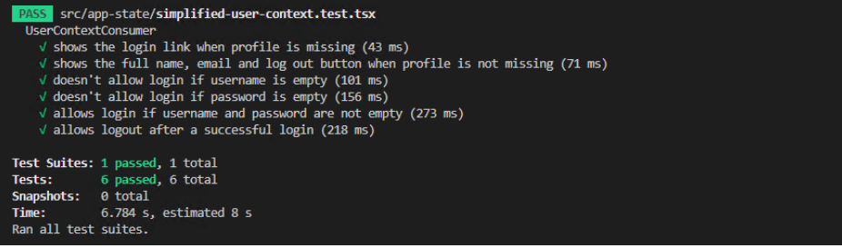
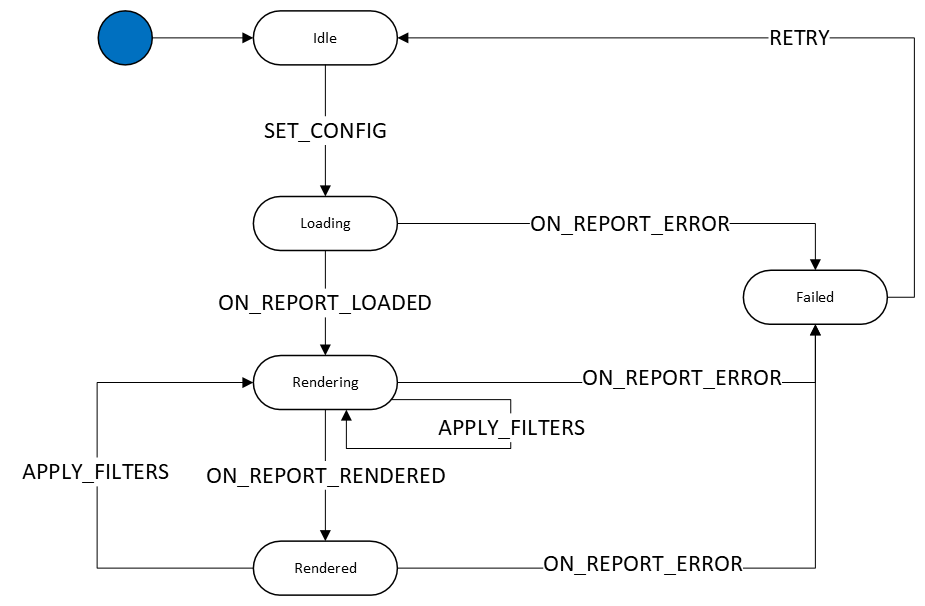

# React state management with Context and Reducers

Luis Cañas Iniesta

*25th May 2022*

## Overview

I started building web apps a long time ago. In the beginning everything was server-side: PHP, ASP.NET, etc. with little or no javascript in the front-end. Then I had to add more and more javascript, but when the app got complicated and I had to handle the DOM across different browsers and browser versions… “Oh this is a nightmare!”😱
Then jQuery came along and everything changed… “OMG this is the future!” 😍 Until I had to develop a complex app…😱

Then I started with Angular.js and, again, “YEAH! This is the game-changer! The future is now!!” 😍 Until I had to develop another complex app…😱

Well, I am still in this loop, and I suspect it’s infinite. When I started with React in 2017, I had another 😍 feeling because it was a big improvement in my development experience compared to what I was using before. It was designed as a JavaScript library for building UIs, using a declarative style for component rendering based on state. It is great at handling local component state. It allows you to use plain JavaScript (or TypeScript) and import any JavaScript library. It doesn’t mandate a way to handle any of the different aspects of a web app, such as global state. This aspect, state management, is one of the hardest in frontend development. 

We have to manage the app state in the browser, using a stateless protocol such as HTTP. Part of this app state is pure UI state but the rest is usually just a cache of server state (which probably comes from a database). So, we have to somehow deal with another of the most difficult aspects of software development: cache invalidation.

This might explain why there are so many state management libraries for React: Redux, MobX, Apollo, React Query, SWR, Recoil, Zustand, etc.

I have used Redux in the past and I think the required boilerplate and complexities (what I call the ‘piping system’) to make it work is just too much, especially for newcomers. Once the piping is in place and Redux is working, it’s much easier to work with. But as the app grows, you have to create more reducers, actions, dispatch calls, etc. A lot of open files in your editor’s forest of tabs. I think we should simplify this, just like we simplify global configuration and other complicated aspects by using app builders like create-react-app, NextJS, etc.

In this article I want to explain how to handle state management in a simple way without any external library, using the built-in React Context APIs and the useContext and useReducer hooks. In particular, I will show how to implement a very simple Finite State Machine (FSM) to handle a piece of the global state.

## Goal

My goal is to answer the following questions:
1. What is React Context?
2. When to use external state managers?
3. How to manage global state with React Context?
4. How to create a simple Finite State Machine with Context and useReducer?

## What is React Context

> React Context provides a way to pass data through the component tree without having to pass props down manually at every level.

Basically, it is an object you can interact with from any component inside the children tree of the Context Provider. So, it needs a provider with a default context's object, and all of the provider's children can use this object. As this context object allows us to handle state at the app level, we can say that React has a built-in mechanism for state management; there is no need to install external libraries.

Good for:
- Slow moving global data: theme, authenticated user, preferences, etc. 
- When the data changes, a lot of the UI elements need to update
- Micro frontends: small footprint of data

## When to use external state managers

Sometimes it is better to use one of the many state management libraries. As they are not part of React, we have to do some research. Then we should try and evaluate a few of them and finally choose one, on which we depend from that moment. Therefore, it is important that the chosen library has a wide community supporting and maintaining it.

Good for:
- Fast moving data. 
- Bigger app, more complex state
- Team work when standards are important

## How to manage global state with React Context
We should divide the global state in smaller parts and use these parts as close as possible to the components using it. Divide the global state logically in sub-states, according to the features that depend on these sub-states. Then, place the context as close to the components using it as possible.

Using TypeScript is also very helpful to define and maintain the state. When you refactor the state, for example renaming, changing a function signature, adding or removing elements, TypeScript will inform you immediately if you make any mistakes.

### A not-so-simple example

As I am tired of basic examples, I want to offer you a mid-complexity state management one. Let’s assume we want to manage the current user state using React Context and TypeScript. The state will contain:

- User profile: first/last name, email, settings, etc. Will be null before login and after logout.
- User functions:
  - logIn
  - logOut
  - acceptTermsAndConditions
  - updateUserProfile

These functions will handle the user profile, so we don’t have to worry about it in the components that use this profile. We don’t have to modify the user profile directly. So, let’s define it:

```typescript
export interface UserProfile {
  username: string;
  firstName: string;
  lastName: string;
  email: string;
  settings: { [settingId: string]: string; };
  termsAccepted: boolean;
}
```

Now let’s define the Context itself, which includes user profile and functions:

```typescript
export interface UserContext {
  userProfile: UserProfile | null;
  logIn: (username: string, password: string) => void;
  logOut: () => void;
  updateUserProfile: (profile: UserProfile) => void;
  acceptTermsAndConditions: () => void;
}
```

If, for example, we want to change one of the user settings, we call updateUserProfile with the new settings and the userProfile will be updated (and possibly we will call the API to update it server-side). Then all the components that use the profile from inside the Context Provider will be rendered. This is important because if the affected components tree is very big, a lot of component rendering will take place, possibly slowing down the app. Later we will see how to partially alleviate this by memoizing the Context object.

Now let’s create the Context object using the interface above. We need to pass the initial value of this object, so we pass null as userProfile to indicate that the user is not logged in:

_UserContext.tsx_
```typescript
const CurrentUserContext = React.createContext<UserContext>({
  userProfile: null,
  logIn: () => {},
  logOut: () => {},
  updateUserProfile: () => {},
  acceptTermsAndConditions: () => {}
});
```

We are going to create a custom hook to facilitate the use of this context to the components. It will check that it is called from within the Context provider (it is a common mistake to use a Context from outside the corresponding provider):

_UserContext.tsx_
```typescript
export const useCurrentUser = () => {
  const context = React.useContext(CurrentUserContext);
  if (!context) {
    throw new Error(`useCurrentUser must be used within a CurrentUserProvider`);
  }
  return context;
};
```

Then, let’s say we need a component to display the user email and a button to log out, if the user is logged in, or a link to the login page otherwise; we only have to import this `useCurrentUser` hook and destructure the user profile and the `logOut` function:
```typescript
const ComponentUsingUserContext = () => {
  const { userProfile, logOut } = useCurrentUser();
  return (
    <div>
      {userProfile ? (
        <span>
          {userProfile.email} <button onClick={logOut}>Log out</button>
        </span>
      ) : (
        <a href="/#/login">Log in</a>
      )}
    </div>
  );
};
```
Of course this component should be inside the Context provider, or an error will be thrown and the component won’t be rendered.

Let’s see how to create a wrapper for the provider that should be placed as close to where it’s needed as possible:

_UserContext.tsx_
```typescript
export const CurrentUserProvider = (props: any) => {
  const [currentUserProfile, setCurrentUserProfile] =
    React.useState<UserProfile | null>(null);
 
    // TODO add the logic to handle API calls
 
  const updateUserProfile = (profile: UserProfile) => {
    setCurrentUserProfile({ ...profile });
    // call the API to store the changes...
  };
 
  const memoValue = React.useMemo<UserContext>(
    () => ({
      userProfile: currentUserProfile,
      logIn,
      logOut,
      updateUserProfile,
      acceptTermsAndConditions
    }),
    [acceptTermsAndConditions, currentUserProfile, logIn, logOut]
  );
  return <CurrentUserContext.Provider value={memoValue} {...props} />;
};
```

As you can see we are memoizing the UserContext to avoid unnecessary renders at the provider level. We will add the “TODO” logic later.

Now we are going to locate this provider as close as possible to where it is needed. Imagine we need it only for a user page. We can use this Context provider like this:
```typescript
export const UserPage = () => {
  return (
    <div>
      <CurrentUserProvider>
        <UserContactInfo />
        <UserSettings />
        <UserAccount />
      </CurrentUserProvider>
    </div>
  );
};
```

Then, inside the components `UserContactInfo`, `UserSettings` and `UserAccount` we can use the context with `useCurrentUser` as explained below (`ComponentUsingUserContext`):
```typescript
const { /* objects and functions you need */ } = useCurrentUser();
```

Finally let’s see how we can implement the remaining logic in the provider (the “TODO” part in `CurrentUserProvider`):
```typescript
  // ...
  const {
    logIn,
    userProfile,
    isLoadingUserProfile,
    errorLoadingUserProfile,
 
    logOut,
    loggedOut,
    isLoggingOut,
    errorLoggingOut,
 
    acceptTermsAndConditions,
    termsAccepted,
    errorAcceptingTerms,
    loadingTermsAccepted
  } = useAnyUserAPI();
 
  // 1) this effect loads the response from a successful login api
  //   call and sets the user profile
  useEffect(() => {
    if (
      userProfile &&
      errorLoadingUserProfile === undefined &&
      !isLoadingUserProfile
    ) {
      setCurrentUserProfile(userProfile);
    }
  }, [
    currentUserProfile,
    errorLoadingUserProfile,
    isLoadingUserProfile,
    userProfile
  ]);
 
  // 2) this effect sets the user profile to null when the api call
  //    to logout is successful
  useEffect(() => {
    if (
      loggedOut &&
      errorLoggingOut === undefined &&
      !isLoggingOut
    ) {
      setCurrentUserProfile(null);
    }
  }, [
    loggedOut,
    errorLoggingOut,
    isLoggingOut
  ]);
 
  // 3) this effect updates the user profile when the api call to
  //   accept terms & conditions is successful
  useEffect(() => {
    if (
      currentUserProfile &&
      termsAccepted &&
      errorAcceptingTerms === undefined &&
      !loadingTermsAccepted
    ) {
      setCurrentUserProfile((profile) =>
        profile
          ? {
              ...profile,
              termsAccepted: true
            }
          : null
      );
    }
  }, [
    termsAccepted,
    errorAcceptingTerms,
    loadingTermsAccepted,
    currentUserProfile
  ]);
```

As you can see, we can use any API call mechanism (fetch, Axios…) by implementing the `useAnyUserAPI` custom hook. Then we have to process the responses in useEffects:

1. In the first `useEffect`, we set the user profile when successfully received from the API.
2. In the second `useEffect`, we set the user profile to null after a successful API call to logout.
3. In the third `useEffect`, we set only the value of termsAccepted when the API call is OK; the rest of the user profile props are left untouched.

In these cases, as well as when `updateUserProfile` is called, all the components that depend on userProfile will be re-rendered with the updated profile. These useEffects handle successful calls to API endpoints (`logIn`, `logOut`, `acceptTermsAndConditions`) by updating the profile. In a production app we should handle the error responses as well. To do this, we might add error props to the context so that, when a component makes an API call, it can check the error and perhaps display a message or toast notification. Also we might add functions to clear the errors once the user is notified.

As mentioned below, the API calls logic is implemented in the custom hook `useAnyUserAPI`, where you can use fetch, Axios or any other library, so our context doesn’t depend on this. You can find an implementation using Axios in the code that complements this article.

Now we have all the user state and logic in a Context we can use anywhere in our app. Let’s see how we can test it.

### Testing the Context

In order to test the Context we have just built, we can create a dummy component `UserContextConsumer` and render it inside the provider. Then we have to mock the API calls and test the context functionality by interacting with `UserContextConsumer` just like a user would do. `UserContextConsumer` could display a different content depending on whether the user is logged in or not:

- If logged in, i.e. the user profile is not null, display the user full name and email, and a ‘logout’ button
- If not logged in, display username and password input boxes and a button to log in.

```typescript
const UserContextConsumer = () => {
  const { userProfile, logIn, logOut } = useCurrentUser();
  const [user, setUser] = useState<string>('');
  const [pwd, setPwd] = useState<string>('');
 
  return (
    <div>
      {userProfile ? (
        <div>
          <span>
            {userProfile.firstName} {userProfile.lastName} ({userProfile.email})
          </span>
          <button onClick={logOut}>Log out</button>
        </div>
      ) : (
        <div>
          <input
            value={user}
            onChange={(e) => setUser(e.target.value)}
            placeholder="Username"
          />
          <input
            type="password"
            value={pwd}
            onChange={(e) => setPwd(e.target.value)}
            placeholder="Password"
          />
          <button
            disabled={user.length === 0 || pwd.length === 0}
            onClick={() => {
              logIn(user, pwd);
            }}
          >
            Log in
          </button>
        </div>
      )}
    </div>
  );
};
```

We can test it using `react-testing-library`. To mock the API calls, we can use `Mock Service Worker`. Finally, to emulate the user typing into the input boxes, we can use `@testing-library/user-event`.
This is how to mock the server calls, assuming the endpoints are:

- POST /login 
- POST /logout 
- POST /accept 
```typescript
// import API mocking utilities from Mock Service Worker
import { rest } from 'msw';
import { setupServer } from 'msw/node';
 
// import react-testing methods
import { render, fireEvent, screen } from '@testing-library/react';
import userEvent from '@testing-library/user-event';
 
// add custom jest matcher from jest-dom
import '@testing-library/jest-dom';
 
const server = setupServer(
  rest.post('/login', (req, res, ctx) => {
    return res(
      ctx.json<UserProfile>({
        firstName: 'John',
        lastName: 'Doe',
        email: 'john.doe@gmail.com',
        settings: {},
        termsAccepted: false,
        username: 'johndoe'
      })
    );
  }),
  rest.post('/logout', (req, res, ctx) => {
    return res(ctx.json<boolean>(true));
  }),
  rest.post('/accept', (req, res, ctx) => {
    return res(ctx.json<boolean>(true));
  })
);
 
beforeAll(() => {
  server.listen();
  userEvent.setup();
});
afterEach(() => server.resetHandlers());
afterAll(() => server.close());
```

Ok, now we have a mocked server setup and listening before the tests run. This server responds to the “/login” endpoint with a dummy user profile, to the “/logout” endpoint with true and to the “/accept” endpoint with true as well. The login endpoint receives the username & password in the request body, but we just ignore them and always return the same dummy profile because we are not testing the authentication system. The goal is to test our Context.

Now let’s create a default Context value with empty functions and no user profile:
```typescript
const defaultContext: UserContext = {
  userProfile: null,
  logIn: () => {},
  logOut: () => {},
  acceptTermsAndConditions: () => {},
  updateUserProfile: () => {}
};
```

This is how a basic test could check that, given this default context, the login button is displayed:
```typescript
describe('UserContextConsumer', () => {
  test('shows the login link when profile is missing', () => {
    render(
      <CurrentUserContext.Provider value={defaultContext}>
        <UserContextConsumer />
      </CurrentUserContext.Provider>
    );
    expect(screen.getByText(/^Log in/)).toBeInTheDocument();
  });
  // ...
```

As you can see, this first test is pretty straightforward: it renders our `UserContextConsumer` within the provider, and checks that an element with text ‘Log in’ can be found in the rendered UI.

Now let’s pass a context value with a valid user profile, and check that ‘Log in’ is not rendered and the user’s full name and email, and a button with text ‘Log out’ are rendered:
```typescript
  test('shows the full name, email and log out button when profile is not missing', () => {
    const userContext: UserContext = {
      ...defaultContext,
      userProfile: {
        firstName: 'John',
        lastName: 'Doe',
        email: 'j.doe@domain.com',
        settings: { theme: 'dark' },
        termsAccepted: false,
        username: 'jdoe'
      }
    };
    render(
      <CurrentUserContext.Provider value={userContext}>
        <UserContextConsumer />
      </CurrentUserContext.Provider>
    );
    expect(screen.queryByText(/^Log in/)).not.toBeInTheDocument();
    expect(screen.getByText(`John Doe (j.doe@domain.com)`)).toBeInTheDocument();
    expect(screen.getByRole('button')).toHaveTextContent('Log out');
  });
```

Note that we have not used the mocked server yet, as we are not doing any API calls (the functions in this default context do nothing).

Let’s see how to test that login is not possible if either username or password or both are empty. We can type something in the username or password input boxes, but not in both, click on the ‘Log in’ button, and check that the ‘Log out’ button is not rendered, i.e. the user is not logged in:
```typescript
  test(`doesn't allow login if username is empty`, async () => {
    render(
      <CurrentUserProvider>
        <UserContextConsumer />
      </CurrentUserProvider>
    );
    
    // type something in the password input box...
    await userEvent.type(screen.getByPlaceholderText(/password/i), 'pwd');
    // ...and click the login button
    fireEvent.click(screen.getByText(/^Log in/));
 
    expect(screen.queryByText(/^Log out/)).not.toBeInTheDocument();
    expect(screen.getByText(/^Log in/)).toBeInTheDocument();
  });
 
  test(`doesn't allow login if password is empty`, async () => {
    render(
      <CurrentUserProvider>
        <UserContextConsumer />
      </CurrentUserProvider>
    );
 
    // type something in the username input box...
    await userEvent.type(screen.getByPlaceholderText(/username/i), 'jdoe');
    // ...and click the login button
    fireEvent.click(screen.getByText(/^Log in/));
 
    expect(screen.queryByText(/^Log out/)).not.toBeInTheDocument();
    expect(screen.getByText(/^Log in/)).toBeInTheDocument();
  });
```

Two final tests to check that login is possible when username and password are not empty, and that logging out is possible after a successful login:
```typescript
  test('allows login if username and password are not empty', async () => {
    render(
      <CurrentUserProvider>
        <UserContextConsumer />
      </CurrentUserProvider>
    );
 
    // type something in both input boxes...
    await userEvent.type(screen.getByPlaceholderText(/username/i), 'jdoe');
    await userEvent.type(screen.getByPlaceholderText(/password/i), 'pwd');
    // ...and click the login button
    fireEvent.click(screen.getByText(/^Log in/));
 
    await screen.findByText(/^Log out/);
 
    expect(
      screen.getByText(`John Doe (john.doe@gmail.com)`)
    ).toBeInTheDocument();
  });
 
  test('allows logout after a successful login', async () => {
    render(
      <CurrentUserProvider>
        <UserContextConsumer />
      </CurrentUserProvider>
    );
 
    // type something in both input boxes...
    await userEvent.type(screen.getByPlaceholderText(/username/i), 'jdoe');
    await userEvent.type(screen.getByPlaceholderText(/password/i), 'pwd');
    // ...and click the login button
    fireEvent.click(screen.getByText(/^Log in/));
 
    // then click the logout button...
    const logOutButton = await screen.findByText(/^Log out/);
    fireEvent.click(logOutButton);
 
    // ...and wait for the login button to be shown and logout to be hidden
    await screen.findByText(/^Log in/);
    expect(screen.queryByText(/^Log out/)).not.toBeInTheDocument();
  });
```

Now if everything is correct we should get the green checkmarks:



## How to create a simple Finite State Machine with Context and useReducer

Sometimes it is very useful to use a Finite State Machine (FSM) to handle the state of a component or part of the global state. This is especially recommended when the component lifetime goes through a series of steps or states. Reducers make it easy to implement an FSM.

This is the formal definition of FSM:

> An abstract machine that can be in exactly one of a finite number of states at any given time. The FSM can change from one state to another in response to some inputs; the change from one state to another is called a transition. An FSM is defined by a list of its states, its initial state, and the inputs that trigger each transition.

It might sound complicated but it is not. Let’s see, again, an example: a component that displays an embedded Power BI widget, which normally has the following lifetime:

1. The widget is prefetched; it is waiting for the configuration to be set. State “Idle”
2. We define the widget configuration (report ID, token, etc.); it starts loading. State “Loading”
3. The widget content is loaded; now it starts rendering and we can apply the filters (which depend on user selections). State “Rendering”
4. The widget is rendered and displayed on screen. We can apply different filters. State “Rendered”
5. An error has occurred. We can retry by setting the configuration again. State “Failed”

Steps 1 to 4 are the happy path. There might be different errors: invalid token, token expired, invalid query, invalid filters, etc. And they can occur at any point from step 2.

This is the FSM diagram that captures all the possible states and transitions (the blue circle indicates the initial state):



The ON_REPORT_LOADED / RENDERED / ERROR transitions are events received from the Power BI widget. The rest of transitions are initiated by the user or the app:

- SET_CONFIG: when the widget is in “Idle” state, the app automatically sets the configuration (report ID, token, etc.)
- APPLY_FILTERS: when the user makes a selection, given the widget is in state “Rendering” or “rendered”, the filters are applied to the widget.
- RETRY: when the widget is in “Failed” state, given the user wants to retry, the state is changed back to “Idle”.

Let’s see how to represent these states in our app with TypeScript:
```typescript
export type WidgetState =
  | 'idle'
  | 'loading'
  | 'rendering'
  | 'rendered'
  | 'failed';
```

Yeah, they can be simple strings!
But before defining the FSM transitions, let’s see what is a reducer and an action:
- A reducer is simply a function that takes an state and an action as input, and returns a new state, i.e. it “reduces” the input from state and action to state.
- An action is defined by a type and an optional payload. We can use an action to start a transition.

These are the actions’ types:
```typescript
type WidgetActionType =
  | 'SET_CONFIG'
  | 'ON_REPORT_LOADED'
  | 'ON_REPORT_RENDERED'
  | 'APPLY_FILTERS'
  | 'ON_REPORT_ERROR'
  | 'RETRY';
```

Again, simple strings. The payload depends on the action type:

- SET_CONFIG: report ID, token, and all the required elements to allow the widget to start loading
- APPLY_FILTERS: the filters selected by the user
- ON_REPORT_ERROR: the error information sent by the widget
- ON_REPORT_LOADED, ON_REPORT_RENDERED and RETRY: no payload

```typescript
type SetConfigPayload = {
  reportId: string;
  token: string;
  tokenExpiration: Date;
};
 
type ApplyFiltersPayload = {
  nodeId: number;
  planId: number;
  asOfDate: Date;
};
 
type ReportErrorPayload = {
  error: Error;
};
```

Now we can define an action like this:
```typescript
type WidgetAction = {
  type: WidgetActionType;
  payload?: SetConfigPayload | ApplyFiltersPayload | ReportErrorPayload;
}
```

Observe that the payload is optional (it might be undefined). Now we can create our reducer:
```typescript
const widgetReducer = (
  state: WidgetState,
  action: WidgetAction
): WidgetState => {
  switch (action.type) {
    case 'SET_CONFIG':
      if (state !== 'idle') {
        console.log(`Cannot start loading if not in idle state`);
        return state;
      }
      return 'loading';
    case 'ON_REPORT_LOADED':
      return 'rendering';
    case 'ON_REPORT_ERROR':
      return 'failed';
    case 'ON_REPORT_RENDERED':
      return 'rendered';
    case 'APPLY_FILTERS':
      if (state !== 'rendering' && state !== 'rendered') {
        console.log(
          'Cannot apply filters if not in rendering or rendered state'
        );
        return state;
      }
      return 'rendering';
    case 'RETRY':
      if (state !== 'failed') {
        console.log(`Cannot retry if not in failed state`);
        return state;
      }
      return 'idle';
    default:
      throw new Error(`Unhandled action type: ${action.type}`);
  }
};
```

With this definition, it is very difficult to make any mistakes when adding/removing actions, because TypeScript would catch any invalid action type. Also, if you forget to handle an action type (missing `case` in the `switch`), you would get a runtime error the first time you dispatch it.
 
